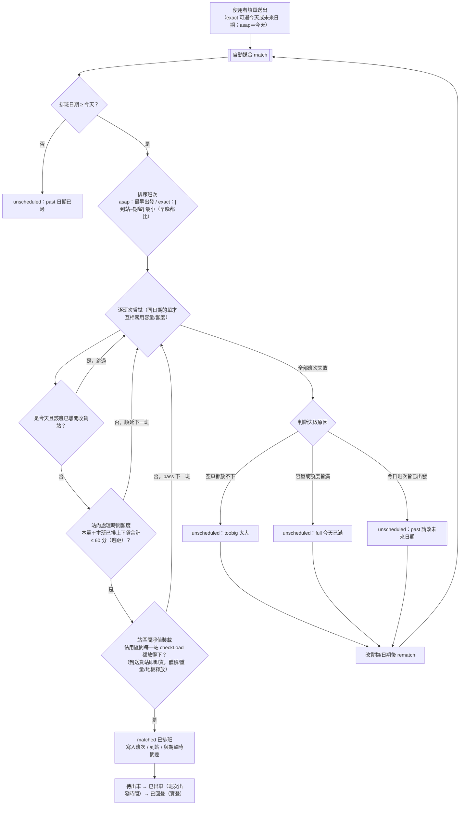
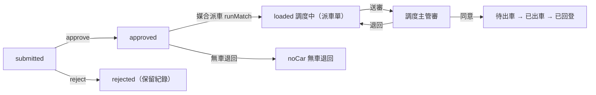
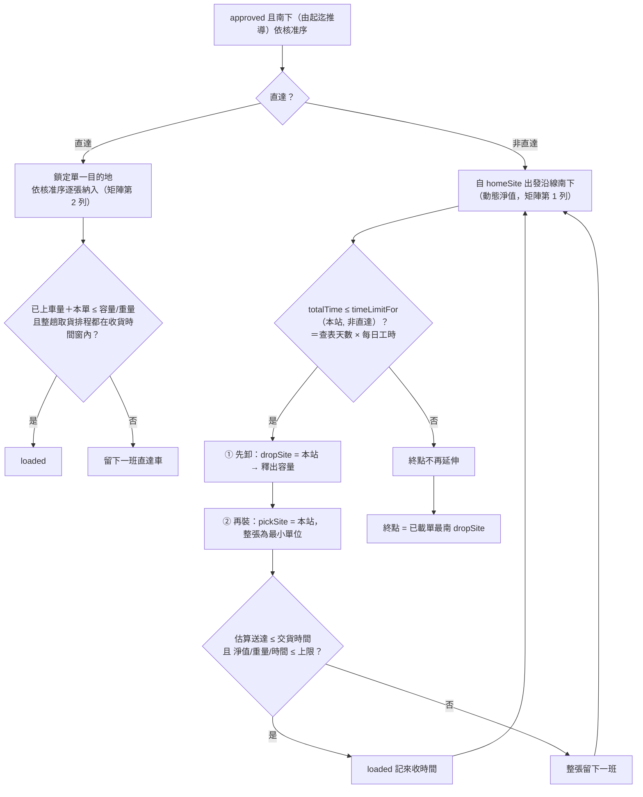
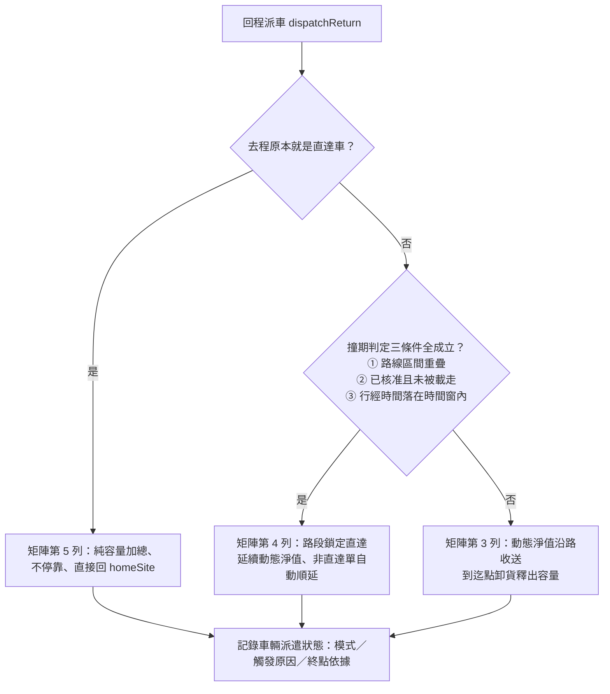
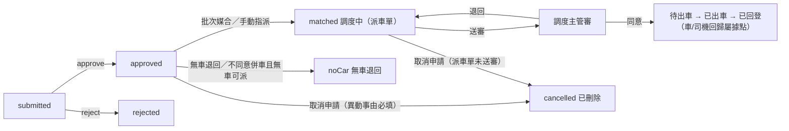
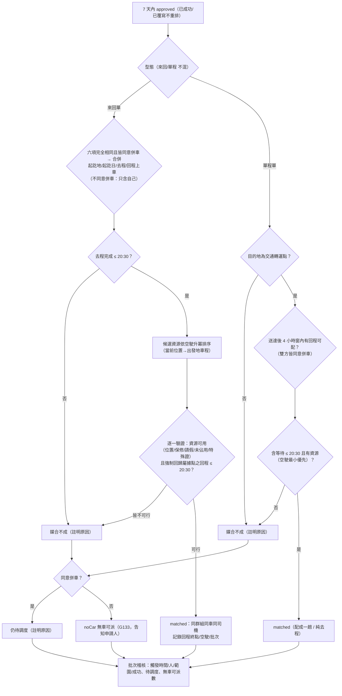

# 系統邏輯彙整（依現行程式碼）

> 本文件依 `js/` 下實際程式碼整理，說明三個模組的**流程（申請→審核→媒合→結案）**與**中間媒合邏輯與條件**。
> 對象檔案：`data.js`(主檔)、`loadengine.js`(共用裝載引擎)、`moduleA.js`、`moduleB.js`、`moduleC.js`、`app.js`(介面控制)。
> 註：數值多為示意（天數表、車程、係數、額度），待業務盤點，不可直接上線。

---

## 申請單狀態（G122，2026-10-03 四模組對齊，`flow.js`）

畫面一律只顯示下列 11 種狀態，由 `Flow.of(rec)` 依「內部 status＋派車單＋簽審＋時間＋實登」推導；各模組內部 status 僅為實作用值。

| 顯示狀態 | 條件 | A 巡迴 | B 院區 | C 差旅 | D 一般用車 |
|---|---|---|---|---|---|
| 申請中 | 暫存未送出 | `draft` | `draft` | `draft` | `draft`（暫存／撤回修改） |
| 待二級審 | 送出待單位主管審核 | —（無此關） | `submitted` | `submitted` | `submitted` |
| 退回修編 | 單位主管退回 | — | `rejected` | `rejected` | `rejected` |
| 待調度 | 主管同意（A：未排入） | `unscheduled` | `approved` | `approved`（媒合不成註明原因） | `approved` |
| 無車退回 | 調度退回待調度單（結案） | `noCar` | `noCar` | `noCar` | `noVehicle` |
| 調度中 | 併入派車單、未送審 | — | `loaded`＋派車單未送審 | `matched`＋派車單未送審 | —（一單一派車單，派車判斷即送審） |
| 調度主管審 | 派車單送審（運輸主管簽審待審） | — | 簽審 pending | 簽審 pending | `dispatched`＋簽審 pending |
| 待出車 | 調度主管同意（A：排入班次） | `matched` | 簽審通過 | 簽審通過 | 簽審通過 |
| 已出車 | 系統時間 ≥ 出車時間 | 收貨日期＋班次出發 | 派車日＋收貨時間 | 出發日期＋去程上車 | 用車起時 |
| 已回登 | 車輛使用實登已登錄里程 | `usage` | `usage` | `usage`（車／司機回歸屬據點） | `usage` |
| 已刪除 | 申請人取消申請（結案，G133；G140 由「已取消」改名） | — | — | `cancelled`（派車單送審前） | — |

- 調度主管退回：B／C 整張派車單回「調度中」（未送審）；D 回「待調度」。已出車後派車單不可再異動。
- 已刪除（G122）：已派車、已交貨（交貨確認）、已駁回，以及 C 待人工協調／已上車／行程完成／逾期作廢，D 整單撤回／已歸還（整段提前歸還）／行程完成。
- 下方各模組「狀態流轉」為內部 status 的實作說明。
- 車輛使用實登單位（G123–G126）：A 以**車次**（`ModuleA.tripUsageSave`）、B／C／D 以**派車單**（`M.usageDispatches()`／`M.dispatchUsageSave(d, data, by)`）登打，經 `Usage.saveGroup` 同步寫入單內每張申請單 `usage` → 已回登。D 一單一派車單：`dispatch()` 非無車退回時給 `app.dispatchNo`（GD###，退回後重派沿用），派車單欄位由 `_refreshDispatch` 依申請單目前指派帶入（`dispatchOrderOf(app)`；刻意不命名 `dispatchOf`，避免 Flow 推導出 D 沒有的「調度中」）。

---

## 〇、共用裝載判定引擎（`loadengine.js`）— A、B 皆引用

### 類別浪費係數 `WasteFactorProvider`
- 由 `DB.wasteFactors` 建快取（static 單例）；查無類別 → 回**保底值** `DB.wasteDefault = 1.30`，不擲例外。
- 係數示意：標準紙箱 1.10、棧板貨 1.20、長條/管材 1.45、不規則件 1.65、桶裝/圓形 1.35、易碎/需空隙 1.55。

### 單品有效值 `itemEffective(it)`
- 體積 `vol = l×w×h / 1000`（公升）。
- **形狀懲罰** `shapePenalty`：長寬比（最長邊/最短邊）> 3 → ×1.10；> 2 → ×1.05；否則 ×1.0。
- **有效體積** `eff = vol × 類別係數 × 形狀懲罰 × 數量`。
- **地板投影** `floor = 次長邊 × 最短邊 × 數量`。
- **重量** `weight = 單件重 × 數量`。

### 主判定 `checkLoad(items, vehicle, startLoad)`
四道關卡，**任一不過即失敗**並回原因碼；`startLoad` 為車上既有負載（逐站累計用）：

| 關卡 | 條件 | 原因碼 |
|---|---|---|
| Level 1 有效體積 | `既有體積 + Σeff ≤ 車輛容量(L)` | `L1_VOLUME` |
| 地板面積瓶頸 | `Σfloor ≤ 車廂地板(車長×車寬)` | `FLOOR` |
| Level 2 維度 | 每件皆能以**六方向旋轉**放進車廂 `(l,w,h)` | `L2_DIM` |
| 重量累計 | `既有重量 + Σweight ≤ 車輛載重上限(kg)` | `WEIGHT` |

> A 模組用**完整 `checkLoad`**（含 Level 2 六方向）。B 模組只用 **Level 1 有效體積 + 重量**（`effVolume`），不做 Level 2 維度檢查。

---

## 一、區域內物流（模組 A，`moduleA.js`）

固定 10 站路線、每日人工排定班次、**送出即自動媒合**（無主管核准）。

### 軟體單元
- A｜收貨申請（使用者）：填單、送出即媒合、查看結果、確認交貨。
- A｜車次追蹤（業務）：追蹤已排定車次、路線班次、駕駛異常回報。
- A｜已排定車次異動（業務）：查詢已排定車次（日期＋班次），明細頁改該車次車輛/司機（以「日期＋班次」覆寫 `shiftPlans`，不動班次主檔）、將單改派班次（`reassignShift` 重算到站）或移出班次（`removeFromShift` 回未排入）。
- A｜司機任務單（駕駛）：以班次（車輛）為單位的沿線收送任務。

### 狀態流轉
```
draft（申請中）──(送出 submitDraft)──▶ submitted ──(自動媒合)──▶ matched（待出車 → 已出車 → 已回登）
                                                    └──────────▶ unscheduled（待調度：rematch 重試／調度改派班次）
                                                                     └──(returnNoCar)──▶ noCar（無車退回，結案）
```
- **無「主管核准」「業務媒合按鈕」「確認接受排班」「交貨確認」**；媒合成功即待出車，到班次出發時間即已出車，實登後已回登（G122）。實登以**車次**為單位（`ModuleA.tripUsageSave(date, shiftId, {vehicle, driver, startKm, endKm}, by)`），儲存後車次內每張申請單同步寫入 `usage` → 已回登；異常回報 `ModuleA.setIncident(app, '' | '使用者不準時' | '使用者沒出現')`（G123）。

### 申請單主要欄位（`createApp`）
- `id`＝**物品運輸單號**（G138）：`car`＋民國年 3 碼＋流水號 5 碼（`nextNo()`，例 `car11500001`，取代 LA###）；`Flow.moduleOf` 以前綴 `ca`（及舊 `LA`）辨識模組 A。`transportStatus`＝「開單」、`applyDate`＝民國年申請日期（`rocDate()`，例 `115/10/10`）、`hazardTransport`（`yes`／`no`，僅記錄）、`remark`。
- `pickStation`(收貨站點) + `pickupLoc`（站點名稱）、`station`(送貨站點) + `building`（G138 表單移除建物，新單為空字串；舊資料仍顯示）、`applyUnit`（申請單位/委運單位，必填）、`consignor`／`recipient`／`recipientAgent`（姓名、分機、院區、館別；委運人與接收代理人分機可改填手機且必填）。
- `deliverTime`(**期望收貨時間**，僅 `exact` 模式用於挑班次，**非硬性截止**)、`expectDiffMin`(排定到站與期望的差，僅供顯示)。
- `serviceDate`(**排班日期**)：`exact` 可指定今天或未來日期（表單 `min` 擋過去）；`asap` 即當天。
- `items[]`(逐件尺寸/類別/數量/重量；G138 加 `plan` 計畫名稱、`workNo` 工令號碼、`pack` 物品外包裝，僅記錄)、`recvMode`(`asap` 越快越好 / `exact` 指定期望時間)。
- `loadMin`+`unloadMin`（表單「裝貨／卸貨所需時間」）= `handleMin`（站內佔用時間）、`submitSeq`(送出序，決定同站處理先後)。
- 表單「是否送出」（G138）：是 → `submit`（建立並立即媒合）；否 → `saveDraft`（申請中）。

### 媒合演算法 `match(app)`
主檔：**每日 5 個班次** `regionalShifts`（08:00、10:30、13:00、15:00、17:00），兩台車輪替。
- **到站時間** = 班次出發時間 + `站序 × 12 分`（示意）。
- **「現在」可注入**：`ModuleA.now()` 預設回傳系統時間，測試可覆寫以確保結果可重現。

**Step 0 日期與時間界線**
- `date = serviceDate`（預設今天）。若 `date < 今天` → 直接回 `past`（日期已過）。
- `date` 是今天 → 界線 `cutoff = 現在時間`；未來日期 → 不設界線（全日班次皆可）。
- **容量與站內額度僅在「同一 `serviceDate`」的單之間競用**——不同日期各自獨立計算。

**Step 1 班次排序（依收貨模式）**
- `exact` 且有期望收貨時間 → 依 `|到站 − 期望時間|` 最小排序（**早晚都比**）。
- `asap`（越快越好）→ 依**最早出發時間**排序。
> 期望時間**只影響挑選順序**，不會因「來不及」而退件（規格 4.1）。

**Step 2 佔用站區間（先卸後裝 3.4/3.5）**
每張單佔用 `[收貨站序, 送貨站序)`；抵達送貨站即卸貨，**有效體積、重量、地板投影同步釋放**。
未帶收貨站者視為自路線起點載運（相容）。

**Step 3 逐班次嘗試（時間軸最近的下一班）**
0. **已發車班次不採計**：班次**發車時間** `≤ cutoff`（今日）→ 車輛已離開基地，**司機出發後無法得知中途新單**，故只排「尚未發車」的班次，跳過。（先前以「抵達收貨站時間」判定，會誤放行已發車、只是還沒開到該站的班次；改以發車時間卡控。）
1. **太大偵測**：空車 `checkLoad` 若放得下，標記 `fitsSomeEmpty`（用於區分「太大」）。
2. **站內處理時間額度**（`SHIFT_HANDLE_BUDGET = 60 分`＝班距）：本單上下貨合計 `handleMin` ＋本班（同日）已排各單合計，**整班全線合計**超過 60 分 → **順延下一班**（G16/G17）。（2026-10-04 更正：舊文寫「每站 40 分」與程式不符。）
3. **裝載判定（站區間淨值）**：對佔用區間內**每一站**，取該站車上淨負載（僅計佔用區間涵蓋該站者）為 `startLoad`，跑 `checkLoad`；
   - 每站都放得下 → `matched`，寫入 `assignedShift`、`arrival`、`expectDiffMin`。
4. **到站時間**（G131）：`shiftArrivalAtStation(班次, 站序, 日期)`＝發車＋站序×`INTER_STATION_MIN`（3 分）＋**前面各站的停站時間**（`stationDwell`：本班同日各單上貨計收貨站、卸貨計送貨站；只給 `handleMin` 者全計送貨站）。期望時間排序與到站時間都含本單在內試算；排入、改派（`reassignShift`）、移出（`removeFromShift`）後以 `refreshArrivals` 重算整班到站，**與期望時間差 `expectDiffMin` 一併重算**（G132）；移出班次者清除到站與時間差。
   - 任一站放不下 → pass 下一班。

**Step 4 全部班次皆失敗 → 分三種原因（不留候補、不排隔日）**

| 情況 | `reason` | 訊息 |
|---|---|---|
| 指定日期早於今天，或今日班次皆已出發 | `past` | 日期已過／今日班次已過，請改指定未來日期 |
| 任一空車都放不下 | `toobig` | 貨物太大，超過任何車輛尺寸/容量 |
| 放得下但各班次容量/站內額度皆滿 | `full` | 今天已滿，請改期 |

> 已**移除** `late` 原因碼：期望時間不再作為成敗依據，只回報 `expectDiffMin`（「較期望時間晚 X 分」）供前端提示。

- **重新媒合** `rematch(app)`：未媒合單編輯貨物後清空舊排班重跑一次。

### 司機任務單（G142 查詢頁＋細節頁）
四模組共用 `renderDriverSheet(cfg)`：查詢頁（日期起迄預設今天～＋14、司機）grid＝細節、日期、出發時間、司機名稱 → 細節頁。A 的 `aDriverTrips()`：一列＝一個「日期＋班次」（`time`＝班次 `depart`、司機＝`logiDriverOf(車輛)` 推定）；細節＝`aDriverCard(date, shiftId, list)`（下述停靠站表）。D 的 `dDriverTrips()`：一列＝一位司機的一段 `liveSegs` 指派區間（雙駕駛各一列、無司機列為 `__self` 自駕），細節＝任務資訊＋隨行貨物。

依 **`serviceDate` ＋ `assignedShift`** 分組，每個「日期＋班次（車輛）」一張任務單（不同日期不混在同一張）。車輛沿固定 10 站路線**一次通過**，故任務單**以停靠站為單位、依站序（S1→S10）排列**：為每張單建立「取貨（收貨站）」與「卸貨（送貨站）」兩個停靠事件，同一站的收/送**自動彙整**（先卸後裝），每站顯示抵達時間、卸貨清單（單號/送貨地點/接收人/狀態）與取貨清單（單號/收貨地點/貨物）。抵達時間走 `shiftArrivalAtStation(班次, 站序, 日期)`（發車＋站序×3 分＋前面各站停站時間，與申請單 `arrival` 一致，G131）。

---

## 二、南北幹線（模組 B，`moduleB.js`）

10 據點南北一直線（D1 屏東 … D10 台北），**基地（出發據點）為 D9 桃園龍潭**（中段位置，走主檔 `homeSite`）；
需**主管准駁**後才進派車池；業務派車採貪婪/直達分流與動態淨值。

### 軟體單元
- B｜幹線託運申請（使用者）、B｜主管准駁（主管）、B｜派車調度（業務）、B｜司機任務單（駕駛）。

### 狀態流轉
```
draft ──▶ submitted ──(approve)──▶ approved（待調度）──(媒合派車 runMatch，併入派車單)──▶ loaded（調度中）
               └──(reject)──▶ rejected（退回修編）        └──(returnOrder)──▶ noCar（無車退回）
loaded ──(派車單送審)──▶ 調度主管審 ──(同意)──▶ 待出車 ──(收貨時間到)──▶ 已出車 ──(實登)──▶ 已回登
                          └──(退回)──▶ 派車單回調度中；調度中可「移出派車單」回 approved
```
> 已**移除** `accepted` 與 `delivered`（交貨確認，G122）。
> 收貨日期對應派車日（G129）：託運單 `wantReceiveDate`（希望收貨日期）；`ModuleB.onDate(o, date)`＝未填日期或收貨日期＝派車日，`runMatch` 期間以 `_matchDate` 套用於 `decideSizeClass`／`_dispatch`／`_dispatchReturn`。`updateDispatch` 對已送審派車單一律拒絕（送審後不可再異動，主管退回 `signReject` 後回未送審）。
> 手動指派（G127）：`ModuleB.manualAssign(o, date, {vehicleType, vehicle, driver1, driver2}, by)` 產生未送審派車單（`manual: true`）；`ModuleB.manualMerge(o, d, by)` 併入 `manualTargets(date)`（同派車日、未送審、未出車）。皆經 `dispatchResourceError` 檢核，不重算路線時間（`pickupTime` 暫取 `wantReceiveTime`）；`unassign` 可移出回待調度。
> 實登以**派車單**為單位（G124）：`ModuleB.usageDispatches()` 列出簽審通過的派車單；`ModuleB.dispatchUsageSave(d, {vehicleType, vehicle, driver1, driver2, startKm, endKm}, by)` 經 `Usage.saveGroup` 寫入派車單 `d.usage／d.usageLog`，並同步到單內每張託運單 `usage` → 已回登。

### 託運單主要欄位（`createOrder`）
- `pickSite`(收貨據點/起)、`dropSite`(送貨據點/迄)。**無 `leg` 欄位**——行程方向由起迄相對順序推導（`isSouthbound`：迄點較南＝南下，較北＝北上），不由申請人勾選。
- `pickupLoc`/`deliverLoc`(建物)、`deliverTime`(交貨時間)、`recipient`(接收人)、`direct`(直達與否)。
- `items[]`(逐件尺寸；G143 加 `plan` 計畫名稱、`workNo` 工令號碼、`shape` 物品外型、`pack` 物品外包裝，僅記錄)、`loadMin`(裝貨所需時間)+`unloadMin`(卸貨所需時間) = `handleMin`。
- G143 新欄位：`transportStatus`(開單)、`applyDate`(民國年)、`tripleFormNo`、`applyUnit`＊、`applyExt`＊、`consignor{name＊,campus,ext＊}`（館別＝`pickupLoc`）、`recipient` 加 `campus`／`agentCampus`＊／`agentHall`＊（接收人館別＝`deliverLoc`＊）、`unloadReadyTime`、`delayReceiveTime`（預設＝可卸貨時間）、`nightOT`／`holidayOT`／`oneway`／`keepMatchDriver`（`yes`/`no`，預設 no）、`hazardTransport`（`yes`/`no`）、`agreeCarpool`（預設 true；false 時 `carpoolRejectReason` 必填）、`remark`、`changeReason`（修改時必填）、`captain`、`captainPhone`。`wantReceiveTime` 畫面名稱改為「可裝貨時間」。除 `hazardTransport` 外僅記錄，`agreeCarpool=false` **不等同** `direct`。
- `formError(data, {editing})`：＊欄位、希望收貨日期、不同意併車須填事由、修改須填異動事由，最後套 `routeError`。是否送審：否＝`createOrder(data,{draft:true})`／`saveDraft`（申請中或退回修編 → 申請中，退回者保留 `revisions`）；是＝`createOrder`／`resubmit`（待二級審）。
- `recompute`：由 items 加總 → `volume`(申報貨量)、`weight`、`effVol`(**有效體積**，容量計算基準)。

### 主管准駁
- `approve(o, note)`：填 `approvedAt`（核准序，供派車排序）；`reject(o, note)`：不進池、保留備註。
- 審核以「是否同意（是/否）＋審核備註（駁回必填）」記錄。

### 時間模型（2.9 / 2.12 / 2.13 / 2.14）
- **行駛時間查表**：`DB.siteTravel` 據點相互路程表（含龍潭/屏東/高雄休息會館），`travelMin(a,b)`；**不再用單一常數×段數**。
- **每日在勤上限 12.5 小時**（`dailyDutyMin`），自表定上班 `08:00` 起算，涵蓋：出勤前緩衝 → 行駛 → 休息用餐 → 裝卸 → 收工緩衝＋**返回休息地**（查表取最近會館）。
- **司機休息用餐**：依**純累積行駛時間**觸發 >3h/30、>4h/60、>6h/30、>8h/30、>10h/30 分；共用不歸零時數線，計入在勤但不推進行駛線；**每日出勤歸零**。
- **跨夜**：當日額度不足即過夜，隔日在勤與行駛時數線同時歸零；達 `maxTripDays` 才停止延伸。
- **媒合截止**：派車日前 2 天 12:00；逾時不接受插單，自動標記順延至下一可媒合車次。

### 派車主檔常數
- **出發（基地）據點 `DB.homeSite = 'D9'`（桃園龍潭）**：主檔參數，不寫死；去/回程方向與行經序列由其在南北順序中的位置推算。
- **可服務範圍 `isServable(o)`＝基地及其以南**：現行車次模型為「自基地南下 → 折返北上回基地」，故**基地以北據點（D10 台北）不在任何路線上**。涉及北側據點的託運單**一律不排入**，並於派車 trace 與待派清單明確標示原因（北側排班方式為 TODO B-2，**待業務確認**），避免載走卻無法卸貨。
- **時間上限＝每日 12.5 小時在勤額度**（見上「時間模型」）。**天數表不參與運算**（3.1）：`minTripDaysFor(車輛, 終點)` 依「車型 × 目的地」查表，僅作排班參考顯示；精算天數超出表定值時**以精算為準照常派車**，僅提醒調度員。
- 容量基準＝**有效體積 `effVol`**（Level 1 + 形狀，不做 Level 2）＋重量。
- **危險品限車（G144）**：車輛主檔 `hazmat: true`＝可載危險品（原型：V-T01）。`isHazard(o)`＝`hazardTransport==='yes'`；`hazardOk(o, vehicleId)`。`_dispatch`／`_dispatchReturn` 先剔除本車不可載的危險品單（trace 註明）；`runMatch` 選車後經 `_hazardPick(dec, 待派單, 已用車, …)`：待派單全為危險品且選定車不可載 → 改派未使用的 hazmat 幹線車（無則停止）。`dispatchResourceError` 對含危險品單的派車單拒絕非 hazmat 車（手動指派、併入、派車單異動共用）。

### 去程派車 `dispatch(vehicleId, mode, dispatchDate)`
僅處理 `approved` 且**南下**（由起迄推導）的單，依 `approvedAt` 排序；帶 `dispatchDate` 時先套用 **2.14 媒合截止**（逾時者標記順延、不排入）。

**直達的兩種來源（3.2）**：`direct` 欄位＝**急件直達**（申請人指定，觸發獨立派車與回程鎖定）；**自然直達**＝時間不足導致未停靠，僅為排程結果（`naturalDirect` 旗標），**不觸發任何分流**。

**(A) 急件直達 `direct`（G38/G39）**
- 取**最早核准直達單**的 `dropSite` 為單一目的地，只服務同 `dropSite` 的直達單（不限起點 `pickSite`）。
- **依核准序逐張納入**（不跑貪婪，G131 修正）：容量只計**已確定上車**的單（`已上車量+eff ≤ 車容量` 且重量足夠），被時間窗剔除的單**不佔容量**；超量留下一班。
- **取貨排程 `schedule`**：依行經順序（`pickSite` 由北而南，同站依核准序）逐站計算行經時間＝表定 08:00＋前置＋`travelMin(出發, pickSite)`＋前面各站累計（上貨＋早到等待）。納入一張單後，整趟各單（含先前已上車者）都須落在收貨時間窗（2.19）內，否則本單媒合不到（不排擠既定行程 2.21）。
- **各單來收時間** `pickupTime` 與時間窗判定**用同一套排程**（G131 修正：原本判定不含前站上貨、回報卻含，可能判定窗內但來收時間晚於窗尾）。
- 抵達目的地 `directEta = 表定 08:00 + 前置緩衝 + travelMin(出發, 目的地) + 沿途上貨與等待總和`（查路程表）。
- 註：急件直達是否允許**不同起點合併**或**僅限基地出發不中停**，規格未界定，列 TODO 待業務確認（見 `docs/TODO.md`）。

**(B) 非直達貪婪 + 動態淨值（G32/G33/G34/G35）**
自 `homeSite` 出發（基地本身即可上貨），沿 `southboundFrom(homeSite)` 逐據點：
1. **行駛**：查路程表；當日額度不足 → 跨夜（隔日歸零），已達最大天數才**停止延伸**。
   > 2.3：**容量觸頂只跳過該張表單、車輛續行**；只有時間觸頂才停止延伸。
2. **先卸貨**：車上以本站為 `dropSite` 者卸下 → 釋出容量（`netVol -= eff`），裝卸時間計入當日在勤。
3. **再裝貨**：本站為 `pickSite` 的 approved 單，依核准序，**整張表單為最小單位**：
   - **交貨時間門檻（2.11）**：估算送達 `estDrop = 表定 08:00 + 當日在勤 + loadMin + travelMin(本站, dropSite)`；`> 交貨時間` → 留下一班。
   - **容量/時間**：`netVol+eff ≤ 車容量` 且 `netWt+weight ≤ 車重` 且 `loadMin ≤ 當日剩餘在勤額度` → 裝入(`loaded`)，記 `pickupTime`；否則整張跳過（留下一班），**車輛續行**。
4. 記錄**峰值淨值** `peakVol`；終點取所有已載單 `dropSite` 之**最南者**。
5. 回程抵達終點（基地）時，卸下以基地為送貨據點者並記錄卸貨時間。

### 五列決策矩陣 `DECISION_MATRIX`（3.7 · G44）
派車模式由**單一決策表**驅動（非散落於各分支），亦為調度室顯示的資料來源：

| # | 情境 | 容量計算 | 終點 | 中途停靠 |
|---|---|---|---|---|
| 1 | 去程・非直達 | 動態淨值（2.4） | 貪婪法自動判斷（2.3） | 逐站收送非直達貨 |
| 2 | 去程・直達 | 純容量加總（3.3） | 申請單目的地 | 不停靠 |
| 3 | 回程・非直達且無撞期 | 動態淨值 | 出發據點（2.7） | 逐站收送非直達貨 |
| 4 | 回程・被迫鎖定直達 | 動態淨值（延續，3.6） | 出發據點（3.6） | 不收新非直達貨，仍依序經過 |
| 5 | 回程・原本就是直達車 | 純容量加總 | 出發據點 | 不停靠 |

### 回程派車 `dispatchReturn(...)`（全域直達鎖定 G40–G43）
- 回程終點固定回 `homeSite`。
- **撞期判定 `collidesReturnDirect(o, 折返點)` 三條件**（全部成立才鎖定）：
  1. **路線**：直達單起訖區間與回程車實際行經區間**重疊**。
  2. **狀態**：該直達單為待調度（已核准）、尚未被任何車次載走（呼叫端以 `approved` 過濾）。
  3. **時間**：回程車行經該單上車據點的預估時間，落在其可派時間窗內——有交貨時間者需 `行經時間 ≤ 交貨時間 + directLockWindowMin`；未指定＝整日可派。**窗寬走主檔，待業務確認**。
- 判定通過 → 路段鎖定直達（第 4 列）；被排擠的非直達單走自動順延（G42）。

### 車輛派遣狀態 `vehicleStatus`（3.8）
每次派車記錄該車：**目前模式**（矩陣五列之一）、**觸發原因**（例：「當天有直達申請單（最早核准 LB004）→ 獨立派車」）、**終點與判定依據**（已載單最南送貨據點／申請單指定目的地／出發據點），供調度室一眼覆核。

### 司機任務單（G142 查詢頁＋細節頁）
`bDriverTrips()`：一列＝一位司機的一趟（派車單 `dispatchId` × 方向 `dispatchDir`，日期取派車單 `date`）；駕駛人1／2 各一列（無指派駕駛時以 `logiDriverOf(車輛)` 推定），出發時間＝該趟最早 `pickupTime`。細節＝`bDriverCard(t)`（下述停靠序）＋同車駕駛。

依 `dispatchVehicle` 分組；把每張單的收貨（`pickSite`）、送貨（`dropSite`）展開為**停靠序**，各據點顯示要「取貨／卸貨」哪些單、收/送地點與接收人。

---

## 三、差旅共乘（模組 C，`moduleC.js`）

商務用車共乘，資源池（車/司機）與 A、B **完全分開**；需主管准駁後由業務**批次媒合**。

### 軟體單元
- C｜出差用車申請（使用者）、C｜主管准駁（主管）、C｜媒合調度（業務）、C｜司機任務單（駕駛）。

### 狀態流轉
```
draft ──▶ submitted ──(approve)──▶ approved（待調度；媒合不成註明原因）──(批次媒合／手動指派，併入派車單)──▶ matched（調度中）
               └──(reject)──▶ rejected（退回修編）     └──(returnApp)──▶ noCar（無車退回）
                                                    └──(不同意併車＋批次無車)──▶ noCar（G133，系統自動）
draft／submitted／rejected／approved／matched（派車單未送審）──(cancelApp，異動事由必填)──▶ cancelled（已刪除，G133／G140）
matched ──(派車單送審)──▶ 調度主管審 ──(同意)──▶ 待出車 ──(出發時間到)──▶ 已出車 ──(實登)──▶ 已回登
G122 已刪除：coordinate（待人工協調）、boarded／completed（已上車／行程完成）、void（逾期作廢）
```
> 派車單鎖定（G130）：`ModuleC.updateDispatch` 對已送審派車單一律拒絕（含撤回送審與 `overrideAssign` 改派），`unassign` 亦不可；運輸主管退回 `signReject` 後派車單回未送審才可再改。
> 手動指派（G128）：`ModuleC.manualAssign(app, {vehicleType, vehicle, driver1, driver2}, by)` 產生未送審派車單（`manual: true`）；`ModuleC.manualMerge(app, order, by)` 併入 `manualTargets(date)`（同出發日期、未送審、未出車）。皆經 `dispatchResourceError` 檢核並寫入 `app.overrides`（人工覆寫紀錄，`overridden` 不再被批次重排）；`unassign` 移出回待調度。
> 實登以**派車單**為單位（G125）：`ModuleC.usageDispatches()` 列出簽審通過的派車單；`ModuleC.dispatchUsageSave(d, data, by)` 經 `Usage.saveGroup` 寫入派車單並同步到單內每張申請單 `usage` → 已回登，再對各單 `_returnResourcesHome`（當前位置回復歸屬據點）。

### 申請單主要欄位（`createApp` → `_fields`，G133 改版）
- **表單存檔欄位**：`applicant`（登入者帶入）、`dept`、`applicantPhone`、`reason`（必填）、`projectCode`、`captain`、`captainPhone`、`homeBase`、`isOneway`、`route`（車輛起迄地點，最多 `ROUTE_MAX`=8 點）、`reportAt`／`endAt`（`yyyy-mm-ddTHH:MM`，單程 `endAt` 為空）、`passengers`、`agreeCarpool`（未指定＝true）、`baseShuttle`、`permitP`、`permitK`、`crossCampus`、`enterTaipei`、`hasCargo`、`manifestNo`／`escortNo`（無載運品不存）、`remark`、`reportPlace`（報到地點，G136）、`personalCargo[]`（隨身貨物 `{name, qty, l, w, h, weight, pack}`，`_cargoRows` 數字欄轉數值，G136）；`changeReason`＋`changeLog[]`（`_change`：修改／取消的異動事由）。
- **媒合內部欄位（推導）**：`type`＝`isOneway ? 'oneway' : 'round'`、`origin`＝`route[0]`、`dest`＝`route` 最後一點、`departDate`／`earliestPickup`＝`reportAt` 拆開、`returnDate`／`earliestReturn`＝`endAt` 拆開（單程＝出發日）、`pax`＝`passengers`、`ext`＝`applicantPhone`。經過地點不參與媒合與車程。
- `_fields` 也接受舊欄位（`origin`／`dest`／`departDate`…，供範例資料、申請引導帶入與測試）並反推表單欄位；同時給新舊欄位時以新欄位為準。
- 車輛起迄地點畫面為 grid（G137）：`caRoute` 陣列＋`caRouteEdit`（同時只編輯一列），儲存時依「順序」移到指定位置；有編輯中的列不可送出。
- `formError(data, {editing})`：事由必填；起迄至少 2 點、最多 8 點、相鄰不重複、起訖不同；報到必填；非單程時結束必填且不早於報到；乘客數 ≥ 1；有載運品時三聯單表單編號、護運單號必填；報到地點必填；隨身貨物有填列時 `cargoRowError`（名稱必填、數量 ≥ 1 整數、長寬高與重量 > 0）；修改時異動事由必填。隨身貨物不參與媒合。
- 車程 `travelMin = bizTravel[起|迄] + bizBuffer(15)`（車程表**對稱**，查無正向則查反向）；`latestArrival` 最晚抵達為**唯讀參考，不參與媒合**。

### 歸屬據點與當前位置（v4 語意區分）
- **`homeSite` 歸屬據點**：行政/資產管理上固定隸屬（保養、常駐、鑰匙管理），**不因單次出差改變**。
- **`currentSite` 當前位置**：排班可用性判斷依據（G59）。無進行中多天任務時兩者相同；已回登（派車單實登 `dispatchUsageSave`）後 `currentSite` **回復** `homeSite`。

### 資源可用性檢核 `findResourceCandidates`（G59/G60/G61 + 空駛最小化）
於商務池（`seats ≥ pax`）中找可用車 + 司機：
- **G59 當前位置**：出發地對應據點 `bizOriginSite` 須等於車/司機 `currentSite`（主檔 `allowCrossSiteDeadhead=true` 時改為允許跨據點調度，**待業務確認**）。
- **G60 車輛保修**：`maintenance` 期間內排除該車。
- **G61 司機請假**：`driverLeaves` 時段重疊排除該司機。
- **特殊證（G133）**：`needPermits(apps)`＝申請單勾選的 `P`／`K`；車輛 `permits` 須全數包含（`vehicleHasPermits`）。批次合併群組／單程配對取聯集；`dispatchResourceError` 同樣檢核（手動指派、派車單異動）。
- **同車/同司機同日**不重複指派（`occupied` 表跨批次/群組共用）。
- **空車移動最小化（最高優化目標）**：空駛 `deadheadMin` ＝查主檔路程表 `siteTravel[當前位置|出發地據點]`（與幹線共用同一張表 2.9）；當前位置＝出發地據點為 0；**當前位置不明或查無路程回傳 `null`，該資源不列入候選**（G131 修正：原本視為 0 而被當成空駛最小優先選中）；候選清單依**空駛總和升冪排序**，取第一個可行者 → 空駛最小優先、車次數次要。**取捨權重待業務確認**。

### 批次媒合 `runBatch(fromDate)`（按鈕觸發）
處理 `fromDate` 起 **7 天內**、`approved` 的單；**已成功單不重排**（G53）；兩型態**不互相混合**（G50）：

**不同意併車（G133，`noCarpool(app)`＝`agreeCarpool === false`）**
- 來回單群組只含自己、單程單不找回程配對，其他單的群組／配對也排除它。
- 媒合不成（查無車程、超工時、無資源）一律走 `_fail` → `_noCarAuto`：`status='noCar'`、`noCarNote`＝「無車可派（不同意併車…）：原因」、`noCarBy`＝「批次媒合 MB###」，批次統計 `batch.noCar`；同意併車者照舊 `_coordinate`（待調度註明原因）。
- `dispatchResourceError`：派車單含 2 張以上申請單且任一不同意併車 → 擋下（手動併入、被併入皆不可）。

**來回單（G54）**
- 六項**完全相同**才可合併：出發地（起點）、目的地（終點）、起始日、結束日、去程上車時間、回程上車時間；且雙方皆同意併車。
- 工時檢核（G52）：去程完成時間須 `≤ 20:30`（`WORK_END`）。
- **多天任務最後一天強制回歸屬據點**：回程終點 `returnTerminal = bizSiteOrigin[車輛.homeSite]`；該回程**仍正常參與合併**（終點相同即可），且其完成時間**一併納入工時檢核**——超時則不派車、仍待調度並註明原因（G122 刪除待人工協調）。
- 逐一檢視候選資源（空駛最小優先），驗證強制回程可行者才指派；查無車程 / 無可用資源 / 回程超時 → 仍待調度並註明原因。
- 成功 → 同群組同車同司機標記 `matched`，並記錄 `returnTerminal`、`forcedReturn`、`deadheadMin`。

**單程單（G51）**
- **處理順序**（G131 修正）：先處理「送往轉運點」的去程，再處理其餘單程單，配對結果不受申請建立順序影響（原本回程單先建立會被當去程檢查而退出）。
- 目的地須為**交通轉運點** `transferPoints`，否則 → 仍待調度並註明原因（未配上去程的回程單同此）。
- 找回程配對（Q35，一趟完整行程）：**同一天**、**同轉運點出發**、**目的地回司機原出發地**（`b.dest === a.origin`）、回程最早上車落在「去程送達時間後 **4 小時窗**」內；等待時間計入工時。
- 含等待仍 `≤ 20:30` 且有資源 → 配成一趟；無回程可配則為純去程；超時/無資源 → 仍待調度並註明原因。
- **座位**（G131／G132）：配對時選車以 `max(去程人數, 回程人數)` 檢核座位。派車單座位檢核 `dispatchPax` 依**時段**計算同時在車人數：每段行程（單程＝去程；來回＝去程＋回程）佔用 `[上車時間, 上車時間＋車程)`（同一天，查無車程以 60 分計），取任一上車時刻的在車人數最大值——時段不重疊（單程去回配對）取較大者，同時出發（來回＋單程、不同轉運點的單程）相加。（G132 修正：G131 依路線分組取最大值，同時出發的不同路線會被誤判可併入。）

### 手動併車 `manualCandidates` / `doManualMerge`（G56）
- 候選＝**前後 1 天**已 `matched` 的單（**不篩目的地、不比時間**），顯示**起訖（出發地 → 目的地）**、出發/最晚抵達、申請人部門分機、已載/剩餘座位（供申請人自行判斷是否順路；不顯示私人手機）。
- 按「完成合併」即向該車搭便車成立，免調度室二次確認。
- G133：不同意併車的單沒有候選（申請端不顯示找便車），含不同意併車單的群組不列入候選。

### 取消申請 `canCancel` / `cancelApp(app, reason, by)`（G133）
- 可取消：`draft`／`submitted`／`approved`／`rejected`；`matched` 須派車單未送審、無簽審待審或生效、未出車。異動事由必填。
- `matched` 者先 `_detach`（移出派車單，派車單無單即 `cancelled`）；寫入 `changeLog`（動作「取消」）、`cancelledAt`／`cancelledBy`，`status='cancelled'` → Flow「已刪除」（G140 改名）。畫面：明細頁卡片是／否單選（預設否，選是才填異動事由）＋「送出」，否＝資料不變。
- 申請送出（G139）：「是否送審」單選（預設否）＋「送出」：否 → `createApp(data,{draft:true})`／`saveDraft`（`saveDraft` 接受申請中與退回修編，皆存為 `draft`，退回修編者先記 `revisions`）；是 → `createApp`／`resubmit`。

### 調度室確認與人工覆寫 `overrideAssign`（STEP 4）
- 調度室檢視批次結果後可**直接手動改派**車輛/司機（含媒合不成的待調度單，建立派車單），**不退回員工重新申請**。
- 每次調整留下**覆寫紀錄**：調整人、時間、調整前後內容（車/司機/狀態）、原因。
- 覆寫過的排班標記 `overridden`，**不得被下一次批次重排**（同「已媒合成功不重排」原則）。

### 批次媒合稽核紀錄（03B）
- 每次批次記錄：批次編號、**觸發時間戳記**、觸發人、處理範圍（起訖日期）、處理單數、成功／未媒合（仍待調度）各幾筆。
- 申請單上記錄 `lastBatch`（最後處理批次）與 `lastBatchResult`（結果）。
- 此為**媒合失敗率統計**的資料基礎。依規格 Q45：系統**不做**保底偵測或自動補跑（業務漏按屬業務端責任）。

### 逾期作廢（G57，已由 G122 刪除）
- 未媒合的單維持「待調度」，由調度手動指派或「無車退回」（`returnApp`，原因必填、結案並通知申請人）。

### 司機任務單（G141 查詢頁＋細節頁）
- `cDriverTrips()`：取 `matched` 且 `Signoff.effective` 的申請單，依 `groupId`＋駕駛（駕駛人1／2 各一）組成一趟任務 `{key, driver, apps, head, date, time}`，依日期＋出發時間排序。
- 查詢頁：日期起訖（預設今天～＋14）、司機篩選；grid＝細節、日期、出發時間、司機名稱。
- 細節頁：車輛、派車單號、型態、車輛起迄地點、最晚抵達、回程（`returnTerminal`）、乘客合計；接送乘客 grid（單號、申請人、部門、分機手機、人數、報到地點、起迄地點）。

---

## 四、流程圖（狀態機＋媒合判斷分支）

> 以下為 GitHub 可直接渲染的 Mermaid 圖；判斷條件與程式一致。

### A 區域內物流：送出即自動媒合



> 期望收貨時間**只影響排序**、不造成退件；排定後回報「較期望時間早/晚 X 分」供提示。

### B 南北幹線：准駁 → 派車







### C 差旅共乘：准駁 → 批次媒合





---

## 附：三模組媒合邏輯對照

| 面向 | A 區域內物流 | B 南北幹線 | C 差旅共乘 |
|---|---|---|---|
| 觸發方式 | 送出**即時**自動媒合 | 業務**按鈕**派車 | 業務**按鈕**批次媒合 |
| 主管核准 | 無 | 有（准駁） | 有（准駁） |
| 路線 | 固定 10 站班次 | 10 據點南北線、貪婪/直達 | 點對點車程表 |
| 容量判定 | 完整裝載引擎（含 Level 2 六方向）＋**站區間淨值** | 有效體積 Level 1 + 重量＋**動態淨值** | 座位數 `seats ≥ pax` |
| 時間條件 | 站內處理時間每班全線合計 ≤ 60 分＋今日已發車班次不採計 | 行駛+裝卸 ≤ **查表天數×工時** + 交貨時間門檻 | 工時 ≤ 20:30 + 單程 4 小時窗 |
| 期望時間 | **僅排序**，回報時間差、不退件 | 交貨時間為**門檻**（晚到留下一班） | 上車時間為合併比對條件 |
| 失敗處理 | past / toobig / full（待調度，可改派或無車退回） | 留下一班 / 自動順延（待調度，可無車退回） | 仍待調度並註明原因（可手動指派或無車退回） |
| 優化目標 | 時間軸最近班次 | 貪婪終點 + 峰值淨值 | **空車移動最小化**（最高目標） |
| 資源池 | 物流池（與 C 分開） | 物流池（與 C 分開） | 商務池（獨立，含保修/請假檢核） |
| 稽核 | — | 車輛派遣狀態（模式/原因/終點依據） | 批次紀錄 + 人工覆寫紀錄 |
